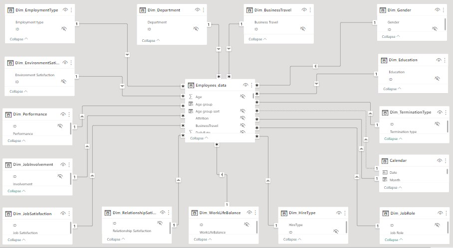
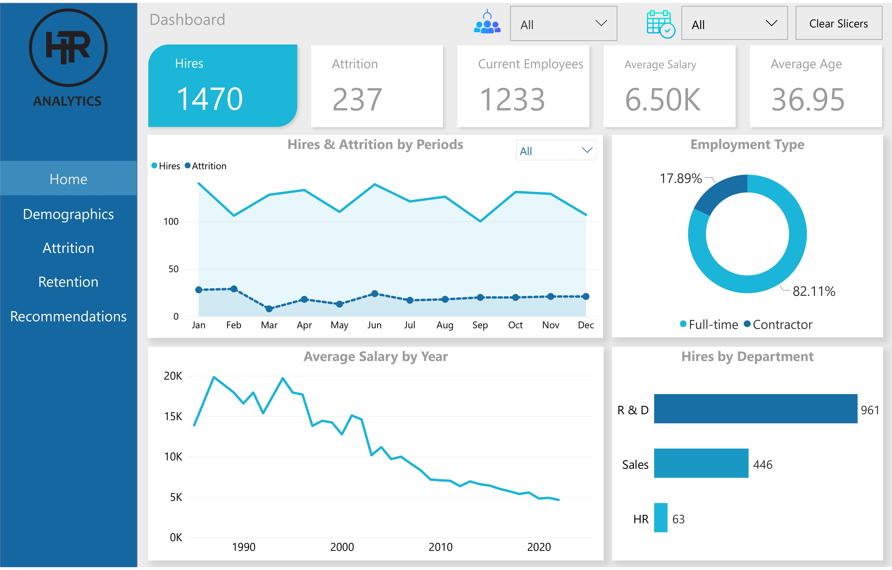
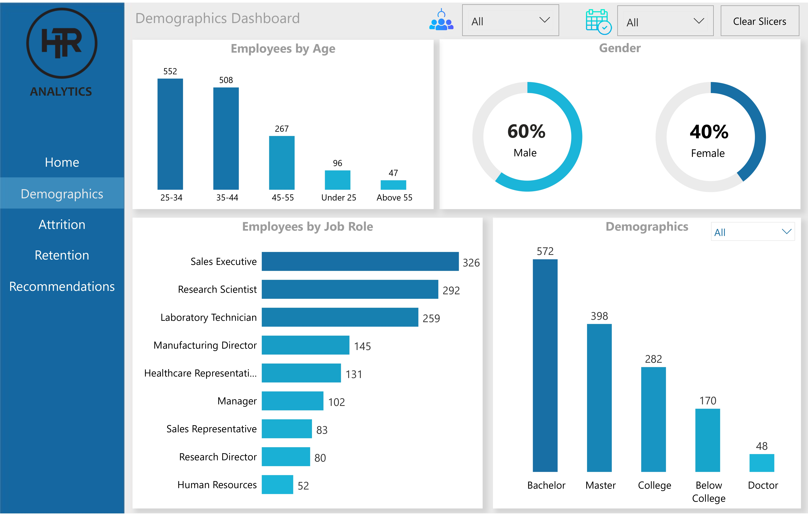
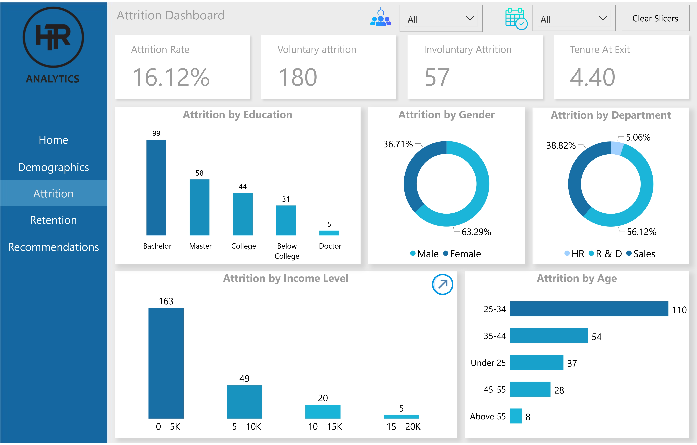
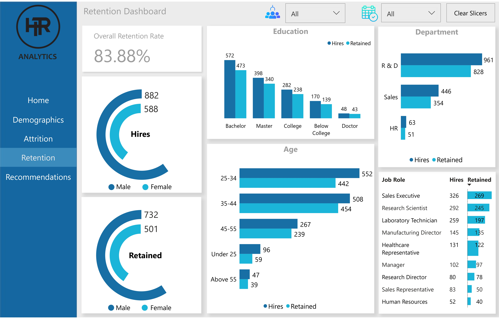

# Analyzing HR Data to Improve Employee Retention and Performance


## Introduction
Finding and hiring the right employees is vital, but retaining them is just as important. One of the biggest challenges facing the Human Resources department today is how to retain and develop top talent in the organization. 
This project presents the analysis of HR data using Power BI. This will enable the organization to gain insights into factors that affect employee retention and performance and identify areas for improvement. 

## Problem Statement
1. What is the number of employees across demographics?
2. What is the total attrition/departures and attrition rate across demographics?
3. What is the retention rate in the organization?
4. What factors contribute to the majority of attrition/departures in the organization?

## Skills Demonstrated
- Data Analysis Expressions (DAX): Effective use of logical, date, time functions, Filters, Calculated columns, and tables.
  Below is one of the DAX measures <br>
  ``` Attrition = CALCULATE([Hire Count], Employees_data[Attrition] = "Yes", USERELATIONSHIP('Calendar'[Date], Employees_data[DepartureDate]), NOT(ISBLANK(Employees_data[DepartureDate]))) ```
- Using field parameters.
- Data Visualization.
- Data Modeling.

## Data Sourcing
This fictional dataset was gotten from **[Kaggle](https://www.kaggle.com/datasets/patelprashant/employee-attrition)**. The dataset contained employees' demographics, attrition, and employment details.

## Data Transformation 
The HR dataset is in an Excel format and was loaded into power query on Power BI for cleaning. Firstly, I renamed the tables using "Dim" as the prefix for dimension tables and "_data" as the suffix for fact table(s). The following transformations were performed on the data;
* Corrected data type for date columns
* Replaced empty cells with **NA**
* Renamed some column headers

## Data Modeling
There are 15 tables in the dataset, although I added a calculated calendar. This was done to ease time intelligence calculations. Therefore, in total, there are 16 tables, 15 dimension tables, and one fact table (employee_data). All the tables were related since they have a matching column in the fact table to produce a one-to-many relationship and form a star schema.

***



## Visualization
The report comprises five pages:
1. Home
2. Demographics
3. Attrition
4. Retention
5. Recommendations

Click [here](https://app.powerbi.com/view?r=eyJrIjoiMzJkN2JhYTctZDU4My00N2U2LWIxZjYtMWM4MTczNjcxOGI2IiwidCI6ImM4N2JkODljLTlmOGMtNDJlNS05NzVkLWQ3ZWYwOWI2OTIxMiJ9&pageName=ReportSectionc4704374b49504a8147a) to interact with the report.



Features:
- There are page navigators on the **Side Bar**, when clicked, redirects to the appropriate page.
- The **Clear Slicers Button** at the top right corner, removes slicer filters that have been applied to the page.
- The **Arrow Button** on the attrition page , displays ratings and other important information.

Key Notes:
- **_Attrition_** is the departure of employees from the organization for any reason (voluntary or involuntary), including resignation, termination, death, or retirement..
- Employee **_Retention_** refers to an organization's ability to hold on to its employees.
- **HR** - Human Resources
- **R & D** - Research and Development

## Analysis

### Home
- The number of hires or employees in the organization is 1470, while 237 employees left the organization and 1233 employees are currently retained.
- Majority of the workfoce are full time workers (82.11%) while the remaining 17.89% are contractors.
- The department with the highest number of hires is R & D, followed by Sales and HR.
- The organization pay an average salary of 6.5K (6,500), although average salary had decreased over time.

### Demographics


- Majority of the employees are of male gender (60%).
- The Sales Executive has the highest number of employees in the organization.
- Employees with bachelors are higher in number compared to other degrees.
- The majority of employees fall into the age bracket of 25 to 34 years.

### Attrition


- Male employees were more likely to leave the organization than their female colleagues. 
- Employees between the age of 25–34 had the highest attrition.
- The least earning employees have the highest attrition.

### Retention 


- The dashboard shows that the employee retention rate in the organization is 83.88%. This means that more than eighty percent of the total employees stayed in the organization

### Recommendations
- This page contains the insights and recommendations.

## Recommendations
- The organization should review its salary structure and make sure it conforms to industry standards. They should increase salaries as the majority of the termination came from employees with very low salaries.
-There should be benefits for employees who work overtime hours since this is an extra workload for them. In addition, the organization should reward high-performing workers to motivate them.
- The organization should ensure their employees are contented and satisfied in the workplace as their unhappiness and dissatisfaction in either the environment or job role may affect their performance negatively. They should also make the workers' engagement a priority.
- A working promotion system should be put in place as a way to reward committed and older employers who are performing well. Employees' relationship with other staff and their superiors should be checked, as unhealthy relationships in the workplace would affect their performance and productivity.
- An evaluation of the hiring process is necessary to avoid future miss-hires.
